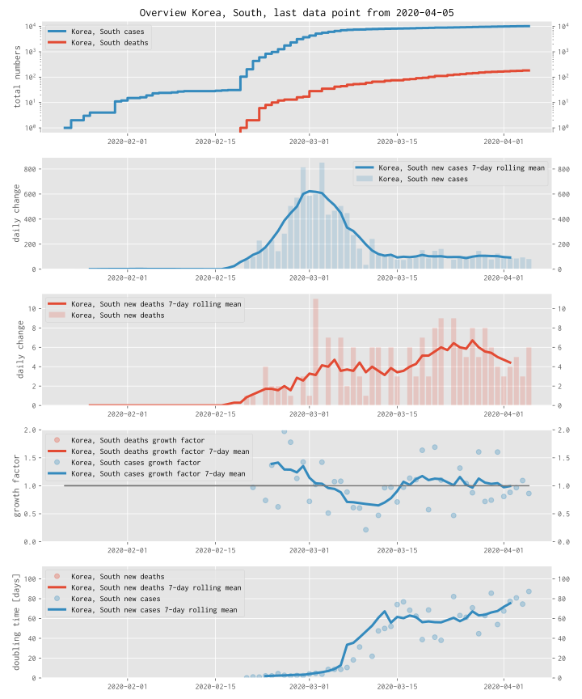

# Coronavirus 2020 - how effective are our measures to slow down the virus?

## Available materials

* Plots for strongly affected countries (discussion below), see
  [index.ipynb](https://github.com/fangohr/coronavirus-2020/blob/master/index.ipynb)
  ([faster version if it works](https://nbviewer.jupyter.org/github/fangohr/coronavirus-2020/blob/master/index.ipynb))
  An example for South Korea is shown below

* Plots for states in Germany (and Pinneberg) - experimental: 
  [germany.ipynb](https://github.com/fangohr/coronavirus-2020/blob/master/germany.ipynb)
  ([faster version if it works](https://nbviewer.jupyter.org/github/fangohr/coronavirus-2020/blob/master/germany.ipynb))
  

* Jupyter notebooks that create these plots and make the data available in
  pandas dataframes.

* Ability to [execute the notebooks in the cloud, to modify them, or inspect the
  trends in other
  countries](https://github.com/fangohr/coronavirus-2020/blob/master/index.ipynb)
  

## Data source and processing

- We use data 
  from the [Johns Hopkins university](https://github.com/CSSEGISandData/COVID-19/tree/master/csse_covid_19_data)
  for countries, 
- and from [German sources (RKI)](https://npgeo-corona-npgeo-de.hub.arcgis.com/)
  for data within Germany.
- All computational steps and code are available [here](https://github.com/fangohr/coronavirus-2020/blob/master/coronavirus.py) -- contributions and corrections welcome.

## Motivation

### Understanding the situation

The reporting in the media on the #COVID19 situation is not always providing
sufficient context to interpret the numbers: we hear many reports about how many
people have been confirmed to be infected by the virus, or have died. 

The relevant questions are though: how do these numbers compare to yesterday,
and the week before? Can we see and understand how quickly infections are
spreading? Can we see if the containment measures of people staying at home,
schools and universities closing etc are showing any effect and if so, how
strong is it? What can we learn from countries that have managed to reduce the
number of new infections?

With the plots and data available here, we hope to contribute to this.

Discussion and contributions are welcome.

### Enable citizen science

* The [source code](https://github.com/fangohr/coronavirus-2020) that creates
  the plots is available here, can be inspected, downloaded, modified and
  improved.

* Using Jupyter Notebooks and the https://mybinder.org project, anyone with a
  web browser can execute the source (to create the same or new plots) from
  within a webbrowser, by clicking [this
  link](https://github.com/fangohr/coronavirus-2020/blob/master/index.ipynb)

## Plans

* Extend this to provide data for Landkreise within Germany, and other more
  local data.

* Further plots to compare slowdowns of the outbreak in different regions.

* Make plots more interactive (plotly?)

## Discussion of example plots

* Discussion of plots from the top (number 1) to the bottom (number 4)

### Plot 1: accumulated cases and deaths as function of time
* Shows how many people have been confirmed to be infected (blue) or have died (red) as a function of time.
* The y-axis is logarithmic, that means from one grid line to the next, the
  value represented increases by a factor of 10. (Axis labels: 102=
  100, 103= 1000, 104= 10000, and so on).
* These numbers are generally reported in the media.
* These numbers can only grow.
* The interesting question is: how fast do they grow?

### Plot 2: daily changes in cases
* Shows how many new confirmed cases are reported per day, shown as blue bars.
* Blue lines shows a seven day (rolling) average over the bar data - this
  produces smoother data, and in particular removes the effect of the weekend
  (in some countries reported numbers drop during and just after the weekend)
* We would like to see these numbers of daily changes decrease from day to day.
  The faster they go down the better. 
* For the data of South Korea, we can see that the peak of new infections was
  around 1st March 2020, and following that the number of new infections
  decreased to around 100 per day for the second half of March.

### Plot 3: daily changes in deaths
* Red bars shows how many new deaths were reported for each day.
* Red line shows a seven day (rolling) average over the bar data.
* The number of deaths is expected to follow the number of infections with some
  time delay, and reduced by a fraction (the [case fatality
  rate](https://en.wikipedia.org/wiki/Case_fatality_rate)).

### Plot 4: growth factors
* The growth factor is the ratio of new cases (or deaths) today relative to new cases (or deaths) yesterday
* Blue (red) dots show these ratios for cases (deaths), and are computed as the ratio over a week to reduce noise
* The solid line is a 7-day rolling mean over these points to provide smoother data.
* As long as the growth value is greater than 1.0, the number of new infections is increasing
* If the growth value would is exactly 1.0, we have the same number of new infections every day
* The growth factor needs to be below 1.0 for the spread to slow down.
* As this number is computed on the relative change from yesterday to today, we
  can get high fluctuations where the numbers of new cases and deaths is small
  (imagine there was 1 case yesterday, and 7 cases today, this would give a
  growth factor of 7). 

### Plot 5: doubling times
* This plot computes the doubling time of the cases (blue) and deaths (red),
  assuming that the growth of cases and deaths as shown in plot 1 is
  exponential.
  
  * in more detail, we compute the doubling period from one day to the next and
    show this as transparent dots.
    
    If a value of 3 is shown, this means that at that point in time, it took 3
    days for the numbers of cases (or deaths) to double.
     
  * the solid line is a 7-day rolling mean over these data points and provides
    more robust guidance.
    
* Looking at the solid lines, we may be able to assess the spread of the virus. 

  * For many countries, in the early stages of the outbreak, this doubling time
    for confirmed infections (blue line) is somewhere around 2 to 3 days.
  
  * As the spread of infections is reduced (by schools closing, people
    exercising social distancing, staying at home, etc), the growth rate of the
    exponential function becomes smaller, and correspondingly the doubling time 
    increases. 
    
  * We would like to see the doubling time to get larger, as this an indication
    that the growth of infections and deaths is decreasing.
  
  * Hopefully, we can learn from other countries, what kind of doubling period
    has to be achieved, to control the number of infected people.
  
* The example data for South Korea shows that the doubling time grows from
  around 3 days to around 60 days as the number of daily new infections (plot 2)
  decreases.
  
  * as the doubling period reaches 60, the number of daily new infections
    stabilises around 100.
    
  * There is no red curve for the doubling time of deaths as there have
    been too few deaths to be useful for the analysis.

# What about other countries and plots for those?

* More plots for countries with high numbers of reported infections in 
  [index.ipynb](https://github.com/fangohr/coronavirus-2020/blob/master/index.ipynb)
  (needs scrolling down to find plots).

* If your country of interest is not listed, you can [execute the notebook to
  modify the commands to show other countries
  here](https://nbviewer.jupyter.org/github/fangohr/coronavirus-2020/blob/master/index.ipynb)
  
# What about errors in the data?

* The data we have available is likely to be in accurate:
  - Infections can only be confirmed if they are being tested: the more testing
    takes place, the more infected people can be found. Asymptomatic individuals
    may not be tested if tests are prioritised for severely sick, health workers
    or those showing symptoms.
  - Tests may be inaccurate and report false positives or false negatives.
  - Deaths may be easier to detect than infections, but may also be inaccurate.
  - The reporting of cases and deaths may not take place during weekends, or
    there may be delays for other reasons.
  
* Despite the errors in the data, we can try to learn something from it as long
  as we remember the data is not representing the full trush of the situation
  but just the measurement that we have available.
  
  * For some plots on this page, we have omitted data lines or points because
    there were not enough numbers and data points to estimate anything.
    
  * Some data points appear random or as outliers - for some we understand the
    reasons, for others not.
    
* It is possible we have made errors in our processing of the numbers. The
  source code is available for anyone to check. (Please feedback any
  observations.)
    
# Disclaimer

The plots and code here has been put together by volunteers who have no training
in epidemiology. You are welcome to use the material at your own risk. 
The [license is available](LICENSE).

