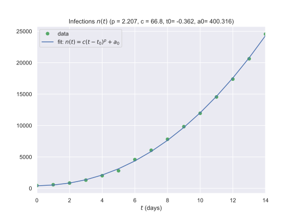

# coronavirus-2020 (covid2019)

- Offering data in Pandas dataFrame to explore.

- We use data from the files at https://github.com/CSSEGISandData/COVID-19/tree/master/csse_covid_19_data/csse_covid_19_time_series

  Thank you @CSSEGISandData for providing the data!

- An exploration of the early infection numbers in China is described in [this link](readme-old.md).

## See the sample notebook

- [Static view of notebook, germany.ipynb](https://nbviewer.jupyter.org/github/fangohr/coronavirus-2020/blob/master/germany.ipynb)

## Execute and modify the notebook using MyBinder

- [Interactive session germany.ipynb (allows execution and modification of notebook with Binder)](https://mybinder.org/v2/gh/fangohr/coronavirus-2020/master?filepath=germany.ipynb)

# Some plots with global numbers

Note: "Active" cases are those that are infected, not recovered and not dead.

# Some plots for Germany

# Fit model of type n(t) = c*(t-t0)^p + a0

# Predicting increase in infections

- Based on data since 25 Feb
- Assumes no significant change to containment measures 

[comment]: <> insert table here
<pre>
Predictions for cases in Germany:

Last data point used in prediction from 2020-03-16 00:00:00

Infections in  1 days:   8579 (17 Mar 2020)
Infections in  2 days:  10400 (18 Mar 2020)
Infections in  3 days:  12501 (19 Mar 2020)
Infections in  4 days:  14912 (20 Mar 2020)
Infections in  5 days:  17662 (21 Mar 2020)
Infections in  6 days:  20782 (22 Mar 2020)
Infections in  7 days:  24305 (23 Mar 2020)
Infections in  8 days:  28265 (24 Mar 2020)
Infections in  9 days:  32697 (25 Mar 2020)
Infections in 10 days:  37638 (26 Mar 2020)
Infections in 11 days:  43128 (27 Mar 2020)
Infections in 12 days:  49206 (28 Mar 2020)
Infections in 13 days:  55915 (29 Mar 2020)
Infections in 14 days:  63297 (30 Mar 2020)
Infections in 15 days:  71396 (31 Mar 2020)
Infections in 16 days:  80261 (01 Apr 2020)
Infections in 17 days:  89938 (02 Apr 2020)
Infections in 18 days: 100476 (03 Apr 2020)
Infections in 19 days: 111927 (04 Apr 2020)
Infections in 20 days: 124344 (05 Apr 2020)
Infections in 21 days: 137780 (06 Apr 2020)
Infections in 22 days: 152292 (07 Apr 2020)
Infections in 23 days: 167936 (08 Apr 2020)
Infections in 24 days: 184772 (09 Apr 2020)
Infections in 25 days: 202860 (10 Apr 2020)
Infections in 26 days: 222262 (11 Apr 2020)
Infections in 27 days: 243043 (12 Apr 2020)
Infections in 28 days: 265267 (13 Apr 2020)
Infections in 29 days: 289002 (14 Apr 2020)

Fit parameters: p = 4.157 c = 0.0272 t0= -0.000 a0= 42.739</pre>
