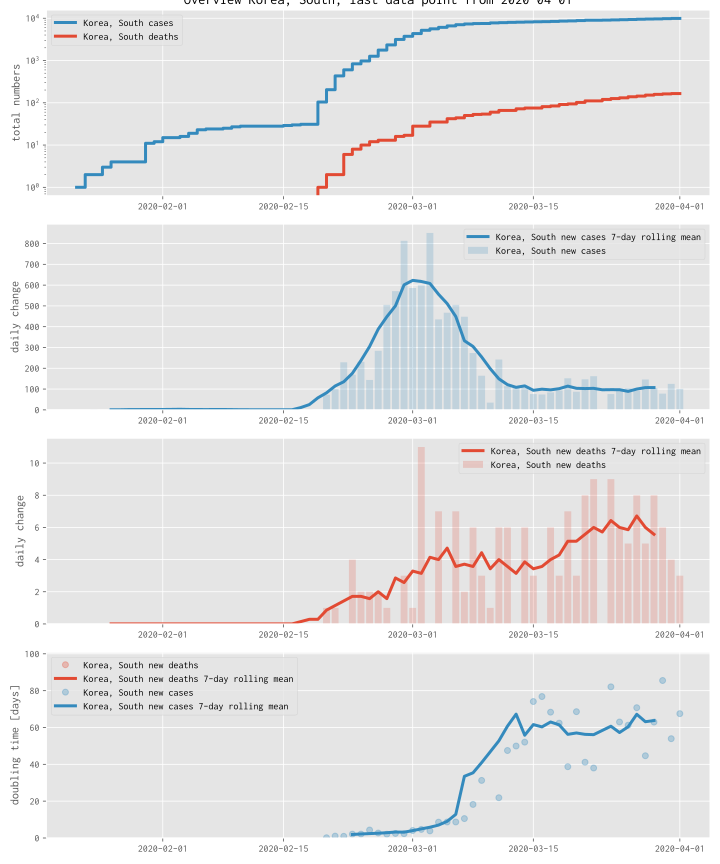

# COVID2019 - how effective are our measures to slow down the virus?

## Available materials

* Plots (discussion to be added), see [index.ipynb](https://nbviewer.jupyter.org/github/fangohr/coronavirus-2020/blob/master/index.ipynb) and scroll down, an example for South Korea is shown below

* Jupyter notebooks that create these plots and make the data available in pandas dataframes.

* Ability to [execute the notebooks in the cloud, to modify them, or inspect the trends in other countries](https://nbviewer.jupyter.org/github/fangohr/coronavirus-2020/blob/master/index.ipynb) and scroll down, an example for South Korea is shown below)

## Data source

- We use data from the files at https://github.com/CSSEGISandData/COVID-19/tree/master/csse_covid_19_data/csse_covid_19_time_series

  Thank you @CSSEGISandData for providing the data!

## Motivation

### Understanding the situation

The reporting in the media on the #COVID19 situation is often not providing
sufficient context to interpret the numbers: During March and April, we hear
many reports about how many people have been confirmed to be infected by the
virus, or have died. The relevant questions are though: how do these numbers
compare to yesterday, and the week before? Can we see if the containment
measures of people staying at home, schools and universities closing etc are
showing any effect and if so, how strong is it? What can we learn from countries
that have managed to reduce the number of new infections?

With the plots and data available here, we hope to contribute to this.

Discussion and contributions are welcome.

### Enable citizen science

* The [source code](https://github.com/fangohr/coronavirus-2020) that creates the plots is available here, can be inspected, downloaded, modified and improved.

* Using Jupyter Notebooks and the https://mybinder.org project, anyone with a webbrowser can execute the source (to create the same or new plots) from within a webbrowser, by clicking [this link](https://nbviewer.jupyter.org/github/fangohr/coronavirus-2020/blob/master/index.ipynb).

## Plans

* Extend this to provide data for Landkreise within Germany

* Further plots to compare progress of the virus in different regions

## Discussion of example plots

* [to be added]
