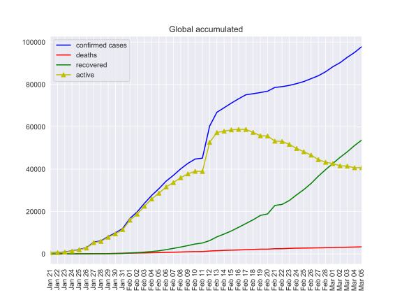
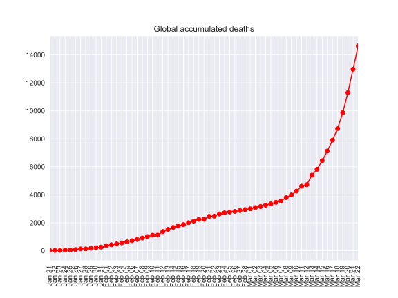
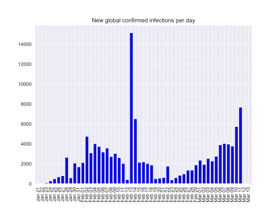
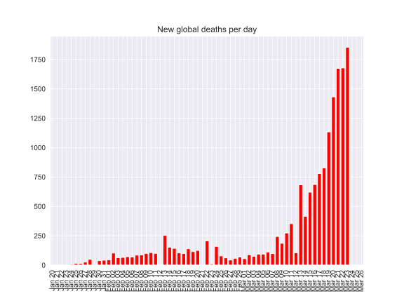
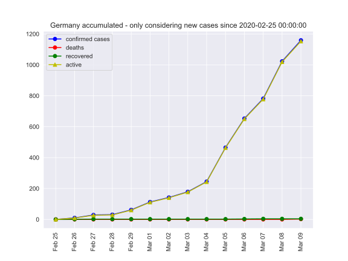
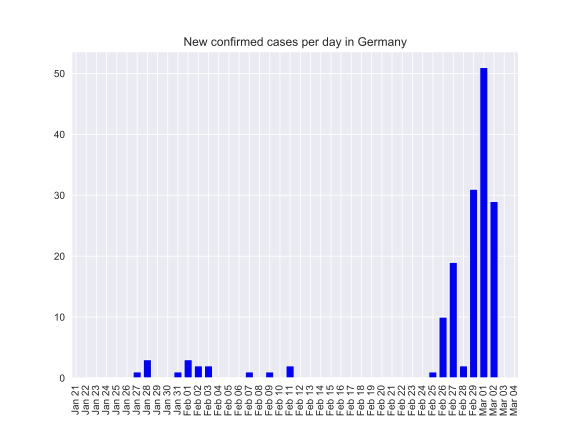
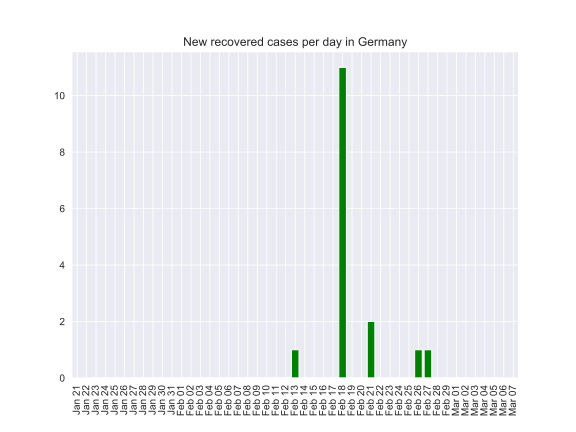
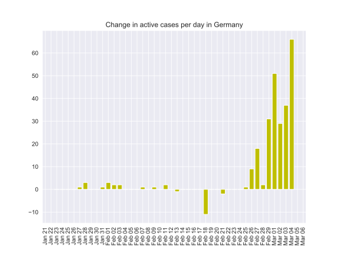
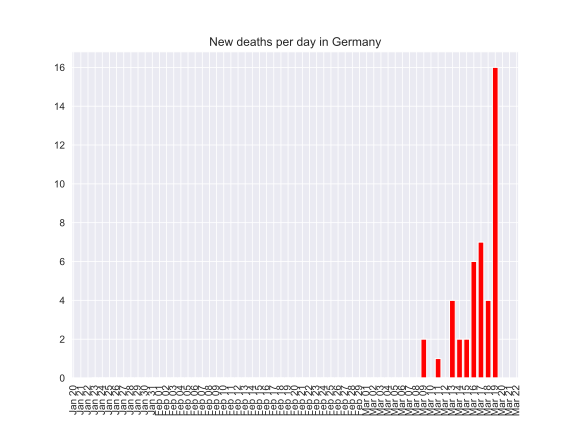

# coronavirus-2020

Offering data in Pandas dataFrame to explore.

(An exploration of the early infection numbers in China is described in [this link](readme-old.md)).

- [Static view of notebook, germany.ipynb](https://nbviewer.jupyter.org/github/fangohr/coronavirus-2020/blob/master/germany.ipynb)
- [Interactive session germany.ipynb (allows execution and modification of notebook with Binder)](https://mybinder.org/v2/gh/fangohr/coronavirus-2020/master?filepath=germany.ipynb)

## Some plots with global numbers

## Germany

