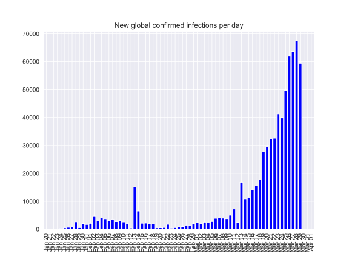
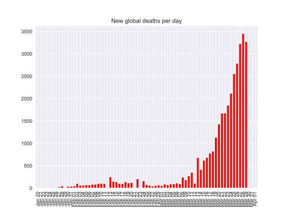
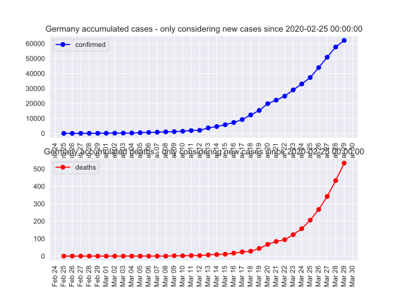
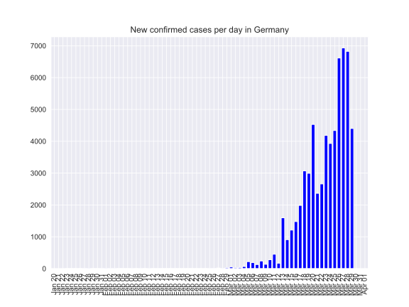
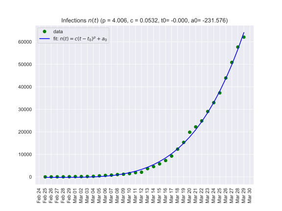

This is kept only for archival purposes.

The most update file is [README.md](README.md).

------------------------------------------

# coronavirus-2020 (covid2019)

This page is it parts a little outdated. Nice plots are available at https://ourworldindata.org/coronavirus

What is available here?

- Offering data in Pandas dataFrame to explore.

- We use data from the files at https://github.com/CSSEGISandData/COVID-19/tree/master/csse_covid_19_data/csse_covid_19_time_series

  Thank you @CSSEGISandData for providing the data!

- An attempt (April 2020) to visualise the effectiveness of 
  virus containment measures in different countries (ongoing work)
  in [index.ipynb](https://nbviewer.jupyter.org/github/oscovida/oscovida/blob/master/index.ipynb), 
  

- An exploration of the early infection numbers in China is described in [this link](readme-old.md).

- Plots below are from [germany.ipynb](https://nbviewer.jupyter.org/github/oscovida/oscovida/blob/master/germany.ipynb), 
  which includes an attempt to fit one polynomial through all the outbreak within one country.
  
- for short term understanding of the data (i.e. over time scales of two weeks,
say), an exponential fit is more appropriate (i.e. for shorter periods where the
growth rate does not change.

  This is explored in [current-trends2.ipynb](https://nbviewer.jupyter.org/github/oscovida/oscovida/blob/master/current-trends2.ipynb) in rough form.

## See the sample notebook

- [Static view of notebook, germany.ipynb](https://nbviewer.jupyter.org/github/oscovida/oscovida/blob/master/germany.ipynb)
- [current-trends2.ipynb](https://nbviewer.jupyter.org/github/oscovida/oscovida/blob/master/current-trends2.ipynb) 

## Execute and modify the notebook using MyBinder

- [Interactive session germany.ipynb (allows execution and modification of notebook with Binder)](https://mybinder.org/v2/gh/oscovida/oscovida/master?filepath=germany.ipynb)

# Some plots with global numbers

Note: "Active" cases are those that are infected, not recovered and not dead.

<

# Some plots for Germany

# Fit model of type n(t) = c*(t-t0)^p + a0

# Fit exponential curves

See [current-trends2.ipynb](current-trends2.ipynb)

# Predicting increase in infections

- Based on data since 25 Feb
- Assumes no significant change to containment measures 

[comment]: <> insert table here
<pre>
Predictions for cases in Germany:

Last data point used in prediction from 2020-03-29 00:00:00

Infections in  1 days:  72281 (30 Mar 2020)
Infections in  2 days:  81208 (31 Mar 2020)
Infections in  3 days:  90937 (01 Apr 2020)
Infections in  4 days: 101512 (02 Apr 2020)
Infections in  5 days: 112981 (03 Apr 2020)
Infections in  6 days: 125395 (04 Apr 2020)
Infections in  7 days: 138804 (05 Apr 2020)
Infections in  8 days: 153258 (06 Apr 2020)
Infections in  9 days: 168812 (07 Apr 2020)
Infections in 10 days: 185520 (08 Apr 2020)
Infections in 11 days: 203437 (09 Apr 2020)
Infections in 12 days: 222620 (10 Apr 2020)
Infections in 13 days: 243129 (11 Apr 2020)
Infections in 14 days: 265022 (12 Apr 2020)
Infections in 15 days: 288361 (13 Apr 2020)
Infections in 16 days: 313208 (14 Apr 2020)
Infections in 17 days: 339627 (15 Apr 2020)
Infections in 18 days: 367682 (16 Apr 2020)
Infections in 19 days: 397441 (17 Apr 2020)
Infections in 20 days: 428970 (18 Apr 2020)
Infections in 21 days: 462338 (19 Apr 2020)
Infections in 22 days: 497616 (20 Apr 2020)
Infections in 23 days: 534876 (21 Apr 2020)
Infections in 24 days: 574190 (22 Apr 2020)
Infections in 25 days: 615633 (23 Apr 2020)
Infections in 26 days: 659279 (24 Apr 2020)
Infections in 27 days: 705207 (25 Apr 2020)
Infections in 28 days: 753493 (26 Apr 2020)
Infections in 29 days: 804218 (27 Apr 2020)

Fit parameters: p = 4.006 c = 0.0532 t0= -0.000 a0= -231.576</pre>
