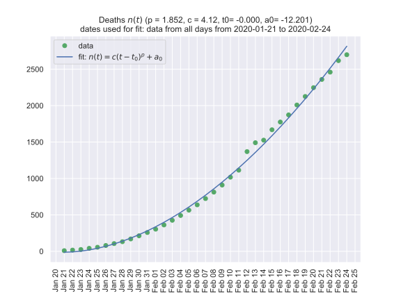

# coronavirus-2020
Predict increase in infections and deaths based on extrapolation of fit

- [Static view of notebook, model.ipynb, data up to 16 Feb, fit like n(t) ~ n^p ](https://nbviewer.jupyter.org/github/oscovida/oscovida/blob/master/model.ipynb)
- [Static view of notebook, model2.ipynb, more recent data, also sigmoidal fit attempt](https://nbviewer.jupyter.org/github/oscovida/oscovida/blob/master/model2.ipynb)

- [Interactive session model.ipynb (allows execution and modification of notebook with Binder)](https://mybinder.org/v2/gh/oscovida/oscovida/master?filepath=model.ipynb)
- [Interactive session model2.ipynb (allows execution and modification of notebook with Binder)](https://mybinder.org/v2/gh/oscovida/oscovida/master?filepath=model2.ipynb)

## What is this?

- an exploration of the data on infection and deaths related to the Coronavirus outbreak early 2020
- all data used from https://www.worldometers.info/coronavirus/
- maybe this opens up the data and situation to more people (citizen science?) Anybody with a browser can re-execute and modify the analysis [here](https://mybinder.org/v2/gh/oscovida/oscovida/master?filepath=model2.ipynb) (Jupyter Notebook and Python skills are needed).
- I find it useful to put statements in the press into the context of actual (reported) numbers
- disclaimer: this is not done by epidemiology experts, [don't trust anything here](https://github.com/oscovida/oscovida/blob/master/LICENSE)
- contributions and discussion is welcome of course
- raw data is available from this URL https://raw.githubusercontent.com/oscovida/oscovida/master/data.txt
- and some processed data is available at https://github.com/oscovida/oscovida/blob/master/figures/table-1.md
- it may not be possible to update this daily

## Update 7 February

It looks like the spread starts to slow down now - this is promising. 

This is best seen in the bar chart showing "New infections per day".

The predictions should here should now fail and overestimate actual numbers
(because the fitted model assumes constant growth during the whole outbreak, 
and actual data points of infection seem to start to deviate from this.
Would be interesting to check this quantitatively).

## Update 10 February

The trend shown in the chart "New infections per day" (of a decreasing number of
new infections reported per day) continues.

There is some discussion what could have cause the stop of increasing
infections, including:
- measures to reduce spread of the virus show impact
- capacities for carrying out tests are exhausted, i.e. we have a backlog of
  people who may be infected but cannot be tested fast enough
  (https://twitter.com/GaelVaroquaux/status/1226256025193525257)
- the classification of 'infected' may have been changed so that the reported
  numbers appear smaller (the change is associated with 7 Feb, see
  https://twitter.com/lwcalex/status/1226840055869632512). Apparently, people
  who do not show symptons are excluded from the reported numbers.
  
  ## Update 12 February
  
  With the new data from 12 February that shows a sudden increase in infection
  cases and deaths, it seems that indeed the previous data points were under
  reporting.
  
  New predictions based on the data of 12 February and later, and some data points around
  22 Jan.
  
## Update 16 Feb

- The data points from the past few days are more erratic than before. We use
  all data for the fits of the model parameters again.
  
## Update 21 Feb

- As there appears to be a slowdown in daily new infections, we try to fit a
  sigmoidal model. See notes in model2.ipynb.
  
## Update 25 Feb

The exercise here, at least with the fits, becomes less meaningful now:

- the deaths are slowing down (for now), so the assumed model is not a good description anymore (although it was in the beginning)
- the sigmoidal model for infections also doesn't fit the data so well.
- the outbreak is slowing down in China, but starting up in other places. It
  would be interesting to repeat the plots/fits for each area of the new
  outbreaks, but that's too much effort to carry out here.
  
This site: https://covid2019.azurewebsites.net has a wealth of data, nicely
categorized into countries and days, and also reports interesing graphs (such as
https://twitter.com/jodigraphics15/status/1231664567517949959) from the Twitter account https://twitter.com/jodigraphics15

I'll probably stop updating this page because of the reasons listed above.

  
    
## Infections

## Deaths

## Predictions

In the tables below: "Prediction date" 31 January means that the prediction was
made with data available on the 31 Jan 2020. At that point, infections and
deaths were reported up to 30 January. The "1-day ahead prediction" is thus
predicting the numbers for 31 Jan (which typically become available the day
after, i.e. 1 Feb 2020 in this example).

As the basis for the data, we use the numbers from
https://www.worldometers.info/coronavirus/, which are shown when hovering with
the mouse over the data points in the two graphs. These are updated (according
to the graph) at at GMT+8h every day. (Other numbers on that webpage update more
frequently during the day.)

See [notebook](https://nbviewer.jupyter.org/github/oscovida/oscovida/blob/master/model.ipynb) for more details.

### Deaths

| Prediction date |  1-day ahead predicted |  actual |   10 days ahead predicted |          actual |
| --------------- | ---------------------: | ------: | ------------------------: | --------------: |
| 31 Jan 2020     |                    262 |     258 |                      1072 |             910 |
| 1 Feb 2020      |                    312 |     304 |                      1120 |            1018 |
| 2 Feb 2020      |                    361 |     362 |                      1104 |            1114 |
| 3 Feb 2020      |                    423 |     426 |                      1230 |            1369 |
| 4 Feb 2020      |                    493 |     492 |                      1393 |            1491 |
| 5 Feb 2020      |                    566 |     565 |                      1518 |            1619 |
| 6 Feb 2020      |                    645 |     638 |                      1650 |            1699 |
| 7 Feb 2020      |                    724 |     724 |                      1746 |            1775 |
| 8 Feb 2020      |                    813 |     813 |                      1891 |            1873 |
| 9 Feb 2020      |                      ? |     910 |                         - |            2009 |
| 10 Feb 2020     |                      ? |    1018 |                         - |            2126 |
| 11 Feb 2020     |                   1124 |    1114 |                      2408 |            2247 |
| 12 Feb 2020     |                      ? |    1369 |                         - |            2360 |
| 13 Feb 2020     |                   1504 |    1491 |                      3056 |               ? |
| 14 Feb 2020     |                   1619 |    1526 |                      3006 |               ? |
| 15 Feb 2020     |                   1753 |    1699 |             3186 (24 Feb) |               ? |
| 16 Feb 2020     |                   1865 |    1775 |             3699 (25 Feb) |               ? |
| -               |                      - |       - |                         - |               - |
| 21 Feb 2020     |                   2476 |       ? |              4109 (1 Mar) |               ? |

### Infections

| Prediction date |  1-day ahead predicted |  actual |   10 days ahead predicted |      actual |
| --------------- | ---------------------: | ------: | ------------------------: | ----------: |
| 31 Jan 2020     |                  12358 |   11948 |                     48558 |       40553 |
| 1 Feb 2020      |                  14687 |   14551 |                     50738 |       43099 |
| 2 Feb 2020      |                  17436 |   17387 |                     55286 |       44919 |
| 3 Feb 2020      |                  20498 |   20626 |                     60621 |       60327 |
| 4 Feb 2020      |                  23956 |   24553 |                     67084 |       65246 |
| 5 Feb 2020      |                  28137 |   28276 |                     77138 |       67100 |
| 6 Feb 2020      |                  32417 |   31439 |                     85451 |       69197 |
| 7 Feb 2020      |                  36170 |   34875 |                     88039 |       71329 |
| 8 Feb 2020      |                  39987 |   37552 |                     91704 |       73332 |
| 9 Feb 2020      |                      - |   40553 |                         - |       75184 |
| 10 Feb 2020     |                      - |   43099 |                         - |       75700 |
| 11 Feb 2020     |                  49526 |   44919 |                     95403 |       76676 |
| 12 Feb 2020     |                      - |   60327 |                         - |       77673 |
| 13 Feb 2020     |                  66627 |   71321 |                    140086 |           ? |
| 14 Feb 2020     |                  71321 |   67100 |                    134404 |           ? |
| 15 Feb 2020     |                  77349 |   69197 |           142640 (24 Feb) |           ? |
| 16 Feb 2020     |                  69197 |   71329 |                    137216 |           ? |
